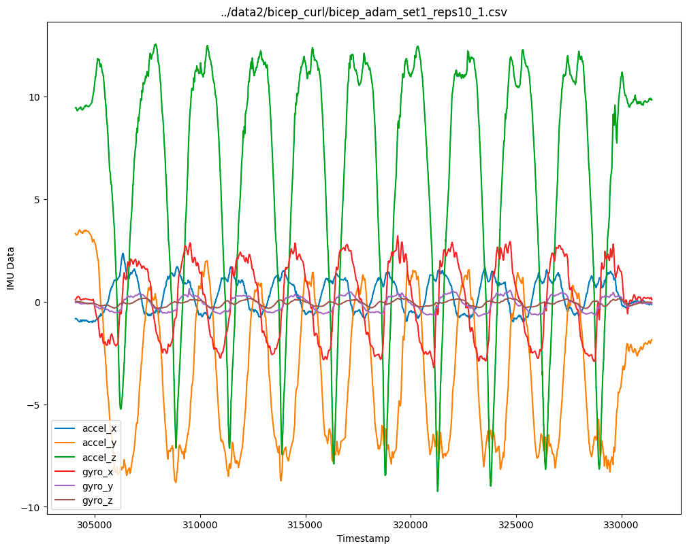
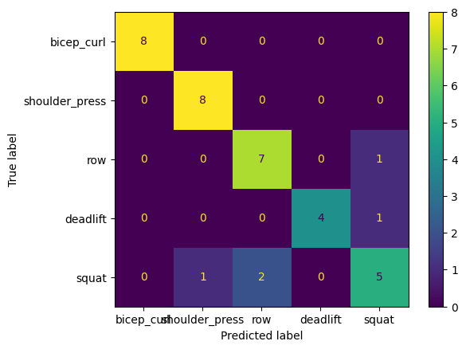

# Activity Tracking with IMU's

Our data is currently collected with the IMU attached to the center of the barbell.

## Data Analysis

Done in ``feature.ipynb``

### Bicep Curl

What the data looks like:

### Confusion Matrix

87% classification accuracy:

